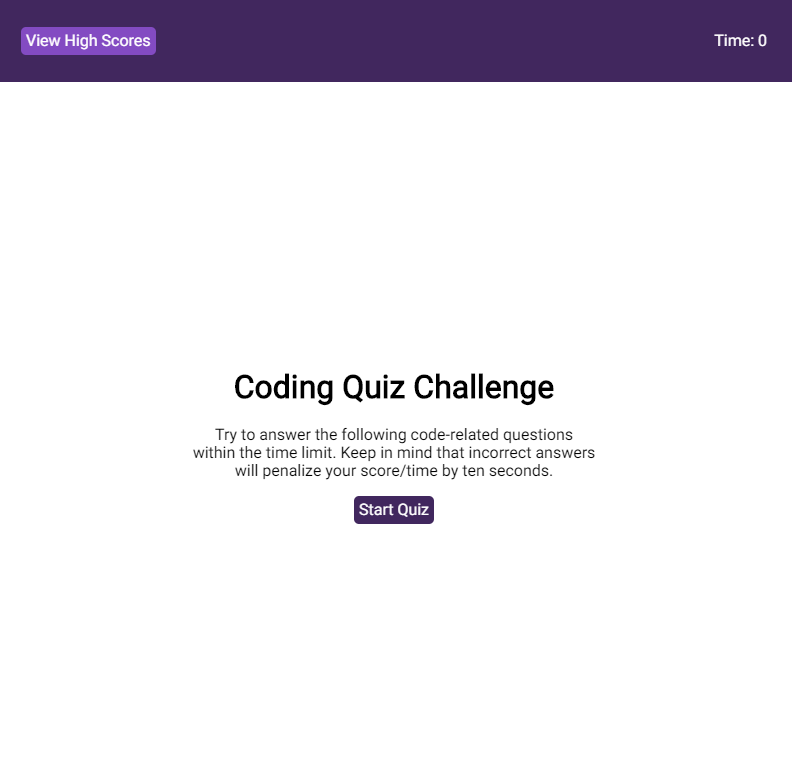

# Code-Quiz

Assignment 4 for University of Toronto coding bootcamp.

Live Demo:  https://andydurette.github.io/Code-Quiz/

This assignment focused on creating a time quiz program. I handled this by replacing the values in the questions to use less html markup. I only ended up having 5 section tags with the data was handled within. Each of these sections I had showing or hidden depending on events such as time, completing the quiz or submitting a high score.

The 5 sections where.

1.Intro
2.Quiz
3.Score Submission
4.High Score screen
5.A dialog box to show if the the user got answers correct/wrong or didn't fulfill a requirement of the High Score submission.

